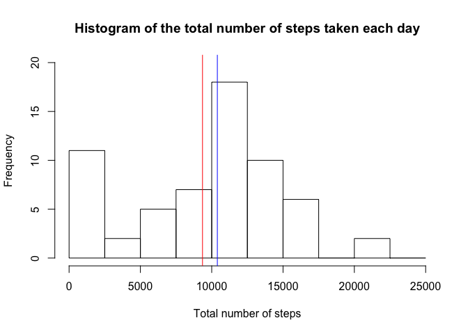
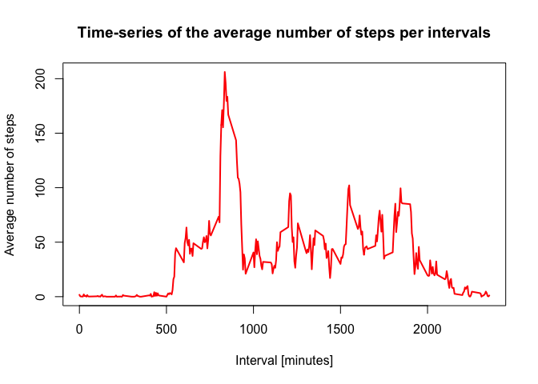
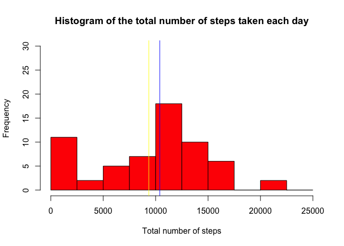
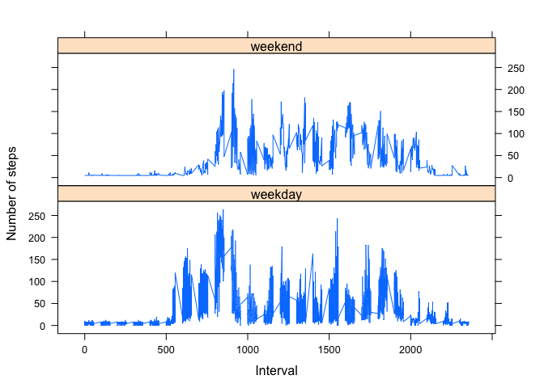

# Reproducible Research: Peer Assessment 1


## Loading and preprocessing the data

1. Load the data
2. Process/transform the data (if necessary) into a format suitable for your analysis


```r
# Load the raw activity data
activity<- read.csv("activity.csv", stringsAsFactors=FALSE)
```


```r
# Transform the date attribute to an actual date format
activity$date <- as.POSIXct(activity$date, format="%Y-%m-%d")

# Compute the weekdays from the date attribute
activity <- data.frame(date=activity$date, 
                           weekday=tolower(weekdays(activity$date)), 
                           steps=activity$steps, 
                           interval=activity$interval)

# Compute the day type (weekend or weekday)
activity <- cbind(activity, 
                      daytype=ifelse(activity$weekday == "saturday" | 
                                     activity$weekday == "sunday", "weekend", 
                                     "weekday"))

# Create the final data.frame
activity <- data.frame(date=activity$date, 
                       weekday=activity$weekday, 
                       daytype=activity$daytype, 
                       interval=activity$interval,
                       steps=activity$steps)
```

## What is mean total number of steps taken per day?

For this part of the assignment, you can ignore the missing values in the dataset.

1. Calculate the total number of steps taken per day
2. If you do not understand the difference between a histogram and a barplot, research the difference between them. Make a histogram of the total number of steps taken each day
3. Calculate and report the mean and median of the total number of steps taken per day


```r
# Compute the total number of steps each day (NA values removed)
sumdata <- aggregate(activity$steps, by=list(activity$date), FUN=sum, na.rm=TRUE)

# Rename the attributes
names(sumdata) <- c("date", "total")
```

We display the first few rows of the *sumdata* data frame:


```r
head(sumdata)
```

```
##         date total
## 1 2012-10-01     0
## 2 2012-10-02   126
## 3 2012-10-03 11352
## 4 2012-10-04 12116
## 5 2012-10-05 13294
## 6 2012-10-06 15420
```

Calculate the mean and median:


```r
mean(sumdata$total)
```

```
## [1] 9354.23
```

```r
median(sumdata$total)
```

```
## [1] 10395
```

Plot the Histogram


```r
hist(sumdata$total, 
     breaks=seq(from=0, to=25000, by=2500),
     xlab="Total number of steps", 
     ylim=c(0, 20), 
     main="Histogram of the total number of steps taken each day")
abline(v=mean(sumdata$total),col = "red")
abline(v=median(sumdata$total),col = "blue")
```

<!-- -->

## What is the average daily activity pattern?

1. Make a time series plot of the 5-minute interval (x-axis) and the average number of steps taken, averaged across all days (y-axis)
2. Which 5-minute interval, on average across all the days in the dataset, contains the maximum number of steps?

```r
# Compute the means of steps accross all days for each interval
meandata <- aggregate(activity$steps, 
                       by=list(activity$interval), 
                       FUN=mean, 
                       na.rm=TRUE)

# Rename the attributes
names(meandata) <- c("interval", "mean")
```

we display the head of *meandata*:


```r
head(meandata)
```

```
##   interval      mean
## 1        0 1.7169811
## 2        5 0.3396226
## 3       10 0.1320755
## 4       15 0.1509434
## 5       20 0.0754717
## 6       25 2.0943396
```

The time serie plot is created by the following lines of code


```r
plot(meandata$interval, 
     meandata$mean, 
     type="l", 
     col="red", 
     lwd=2, 
     xlab="Interval [minutes]", 
     ylab="Average number of steps", 
     main="Time-series of the average number of steps per intervals")
```

<!-- -->

Which 5-minute interval, on average across all the days in the dataset, contains the maximum number of steps?


```r
# We find the position of the maximum mean
max_loc <- which(meandata$mean == max(meandata$mean))

# We lookup the value of interval at this position
max_interval <- meandata[max_loc, 1]
max_interval
```

```
## [1] 835
```

## Imputing missing values

1. Calculate and report the total number of missing values in the dataset
2. Devise a strategy for filling in all of the missing values in the dataset. The strategy does not need to be sophisticated. For example, you could use the mean/median for that day, or the mean for that 5-minute interval, etc.
3. Create a new dataset that is equal to the original dataset but with the missing data filled in.
4. Make a histogram of the total number of steps taken each day and Calculate and report the **mean** and **median** total number of steps taken per day. Do these values differ from the estimates from the first part of the assignment? What is the impact of imputing missing data on the estimates of the total daily number of steps?


```r
# Caclulate NA count.
NA_count <- sum(is.na(activity$steps))
NA_count
```

```
## [1] 2304
```

Devise a strategy for filling in all of the missing values in the dataset. The strategy does not need to be sophisticated. For example, you could use the mean/median for that day, or the mean for that 5-minute interval, etc.


```r
# Find the NAs
na_loc <- which(is.na(activity$steps))

# Create a vector of means
meanvec <- rep(mean(activity$steps, na.rm=TRUE), times=length(na_loc))

# Replace the NAs by the means
activity[na_loc, "steps"] <- meanvec
```

We display the first few rows of the new *activity* dataset:


```r
head(activity)
```

```
##         date weekday daytype interval   steps
## 1 2012-10-01  monday weekday        0 37.3826
## 2 2012-10-01  monday weekday        5 37.3826
## 3 2012-10-01  monday weekday       10 37.3826
## 4 2012-10-01  monday weekday       15 37.3826
## 5 2012-10-01  monday weekday       20 37.3826
## 6 2012-10-01  monday weekday       25 37.3826
```

Make a histogram of the total number of steps taken each day and calculate and report the mean and median total number of steps taken per day. Do these values differ from the estimates from the first part of the assignment? What is the impact of imputing missing data on the estimates of the total daily number of steps?


```r
# Compute the total number of steps each day
newsumdata <- aggregate(activity$steps, by=list(activity$date), FUN=sum)

# Rename the attributes
names(sumdata) <- c("date", "total")
```

The new mean and median are:

```r
mean(sumdata$total)
```

```
## [1] 9354.23
```

```r
median(sumdata$total)
```

```
## [1] 10395
```
Plot the Histogram: 


```r
# Compute the histogram of the total number of steps each day
hist(sumdata$total, 
     breaks=seq(from=0, to=25000, by=2500),
     col="red", 
     xlab="Total number of steps", 
     ylim=c(0, 30), 
     main="Histogram of the total number of steps taken each day")
abline(v=mean(sumdata$total),col = "yellow")
abline(v=median(sumdata$total),col = "blue")
```

<!-- -->

These values differ greatly from the estimates from the first part of the assignment. The impact of imputing the missing values is to have more data, hence to obtain a bigger mean and median value.


## Are there differences in activity patterns between weekdays and weekends?

Create a new factor variable in the dataset with two levels - “weekdays” and “weekend” indicating whether a given date is a weekday or weekend day.


```r
# The new factor variable "daytype" was already in the activity data frame
head(activity)
```

```
##         date weekday daytype interval   steps
## 1 2012-10-01  monday weekday        0 37.3826
## 2 2012-10-01  monday weekday        5 37.3826
## 3 2012-10-01  monday weekday       10 37.3826
## 4 2012-10-01  monday weekday       15 37.3826
## 5 2012-10-01  monday weekday       20 37.3826
## 6 2012-10-01  monday weekday       25 37.3826
```

Make a time series plot of the 5-minute interval (x-axis) and the average number of steps taken, averaged across all days (y-axis)


```r
# Load the lattice graphical library
library(lattice)

# Compute the average number of steps taken, averaged across all daytype variable
meandata <- aggregate(activity$steps, 
                       by=list(activity$daytype, 
                               activity$weekday, activity$interval), mean)

# Rename the attributes
names(meandata) <- c("daytype", "weekday", "interval", "mean")
```

We display the first few rows of the *meandata*:


```r
head(meandata)
```

```
##   daytype  weekday interval     mean
## 1 weekday   friday        0 8.307244
## 2 weekday   monday        0 9.418355
## 3 weekend saturday        0 4.672825
## 4 weekend   sunday        0 4.672825
## 5 weekday thursday        0 9.375844
## 6 weekday  tuesday        0 0.000000
```

The time series plot take the following form:


```r
xyplot(mean ~ interval | daytype, meandata, 
       type="l", 
       lwd=1, 
       xlab="Interval", 
       ylab="Number of steps", 
       layout=c(1,2))
```

<!-- -->
